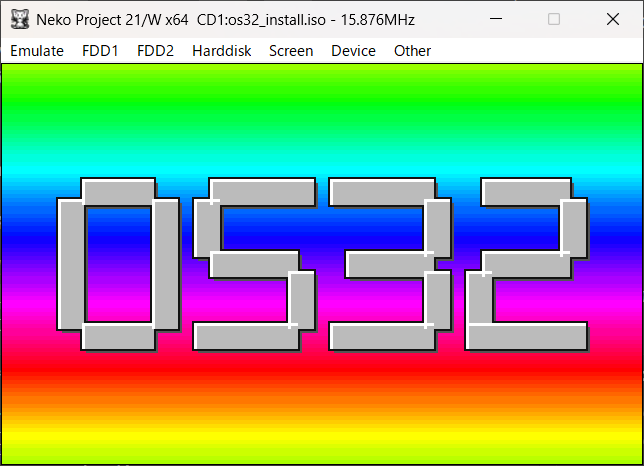
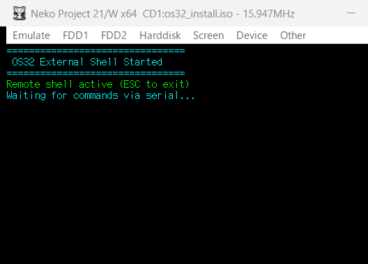

# OS32 — PC-9801 32ビット ベアメタルOS




**OS32** は、NEC PC-9801 / 9821シリーズ向けに開発された、32ビットプロテクトモードで動作するベアメタルOSです。

GCC (i386-elf) クロスコンパイラおよび NASM を用い、WSL (Ubuntu等) 環境上で開発されています。
NP21/W エミュレータまたは実機（未確認）で動作します。

## 制作経緯
昨今AIでのバイブコーディングの波にRide On!しており、昔高校生の頃に遊んでいた「PC98のプログラムとかバリバリかけるんじゃね？」という思いつきで開発を始めました。
最初はDOSで動くプログラムを作って遊び始めましたが、（グラフィックライブラリとか作らせて）だんだんDOSの制約を思い出してきて「面倒くせえ」となり、もっと面倒な思考に陥って「これ、386で動く32bitOSならだいたい解決じゃね？」みたいなとんでもない境地に至りました。
そして、当時より豊富な経験と知識？と先人たちの叡智を集めAIに奴隷労働をさせてとりあえず動く？32bitOSが完成しました。
なにぶんテストもろくに終えてないのでバグだらけですが、何処かの奇特な御仁が実機でテストなどしていただけることを夢見ております。

## 主な機能

### カーネル

- **i386 プロテクトモード** (フラットモデル + ページング)
- **IDT/PIC** 完全制御 (IRQ再マッピング, ISR ハンドラ)
- **ページング** + ガードページ による安全なメモリ管理
- **kmalloc** カーネルメモリアロケータ
- **KernelAPI v26** — 118エントリの関数テーブルによる外部プログラムインタフェース
- プログラム終了時の**リソース自動回収** (FD, リダイレクト, パイプ, 共有メモリ)

### ファイルシステム

- **VFS** (仮想ファイルシステム) 基盤
- **ext2** 読み書き対応
- **FAT12** 読み込み対応 (フロッピーディスク)
- **ISO 9660** 読み込み対応 (CD-ROM)
- パイプ・リダイレクト (`|`, `>`, `>>`, `<`, `2>`)

### デバイスドライバ

| ドライバ | 対象ハードウェア |
|---------|----------------|
| KBD | uPD8251A キーボード (IRQ1) |
| IDE | IDE HDD (NHD イメージ) |
| ATAPI | ATAPI CD-ROM ドライブ |
| FDC | uPD765A フロッピーディスク (fd0) |
| Serial | uPD8251A RS-232C (IRQ4) |
| FM | YM2203 (OPN) FM3+SSG3 |
| RTC | uPD4990A リアルタイムクロック |
| KCG | JIS第1/2水準漢字ROM |

### シェル

- **外部プログラム方式** の高機能シェル
- Tab補完、コマンド履歴、環境変数、`$VAR` 展開、`~` 展開
- ワイルドカード (`*.txt`)、引用符 (`"..."`, `'...'`)
- **スクリプトエンジン** (`.bat` / `.sh` 実行、`if`/`else`/`for`/`while`/`goto`)
- `/etc/profile` による起動時自動設定

### コマンド一覧

#### ファイル操作
`ls` `cat` `cp` `mv` `rm` `mkdir` `rmdir` `touch` `head` `tail` `more` `grep` `wc` `tee` `hexdump` `find` `sort` `diff` `du`

#### システム
`ver` `date` `uptime` `tick` `time` `sleep` `cal` `mem` `env` `echo` `beep` `clear` `reboot` `np2`

#### ストレージ
`mount` `umount` `sync` `format` `ide` `dev`

#### ネットワーク・転送
`send` `recv` `serial` `upload` `rshell`

#### エディタ・ビューア
`edit` (VZ Editor インスパイア) `man` `mdview` (Markdown ビューア)

#### グラフィックス
`gfx_demo` `vbzview` `hrview` `vdpview` `spr_test` `raster` `ekakiuta` `demo1`

#### サウンド
`sndctl` `play`

### グラフィックス

- **640×400 16色** CPU直接描画 (ハードウェアアクセラレータ不使用)
- `libos32gfx` ユーザーライブラリ (点・直線・矩形・円・テキスト描画)
- ダーティレクタングル管理による効率的なVRAM転送
- サーフェス・スプライト・VBZベクタ形式対応
- ラスタパレットアニメーション

## クイックスタート

[INSTALL.md](INSTALL.md) を参照してください。

## ディレクトリ構成

```text
src/os32/
├── boot/       — ブートローダー (16bit/32bit ASM)
├── kernel/     — カーネルコア (IDT/PIC/ページング/kmalloc/コンソール)
├── drivers/    — デバイスドライバ (KBD/IDE/FDC/Serial/FM/RTC/KCG)
├── gfx/        — グラフィックス (CPU直接描画)
├── fs/         — ファイルシステム (VFS/ext2/FAT12/serialfs)
├── exec/       — プログラムローダー (OS32X)
├── kapi/       — KernelAPIラッパー (自動生成)
├── lib/        — ユーティリティ (UTF-8/パス/kprintf/LZSS)
├── include/    — 共通ヘッダ
├── programs/   — 外部プログラム (シェル/エディタ/ツール)
├── tools/      — ビルドツール・スクリプト
└── docs/       — 仕様書・開発ドキュメント
```

## ドキュメント

- [ドキュメント索引](docs/INDEX.md)
- [KernelAPI 仕様書](docs/KAPI_SPEC.md)
- [開発ガイドライン](docs/DEVELOPMENT.md)
- [リリースロードマップ](docs/ROADMAP.md)
- [Git ポリシー](docs/GIT_POLICY.md)

## ビルド

```bash
cd src/os32
make all        # カーネル + 全プログラム + D88イメージ
make clean      # クリーン
make deploy     # NHDイメージへのデプロイ
```

必要なツールチェイン: `i386-elf-gcc`, `nasm`, `make`, `python3`

## ライセンス

[MIT License](LICENSE)

Copyright (c) 2025-2026 すけさん
