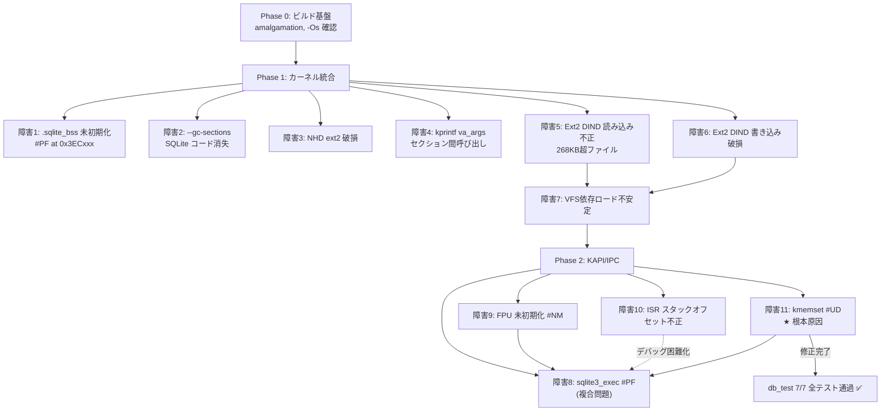

# SQLite 導入障害レポート

OS32 カーネルへの SQLite 3.53.0 統合 (2026-04-24 〜 2026-04-27) で発生した
技術的障害と解決策の包括的な記録。

> [!IMPORTANT]
> このドキュメントは、同様のカーネル拡張を行う際の参考資料として、
> 遭遇した全ての障害・ワークアラウンドを時系列で記録したものです。

---

## 障害一覧サマリ

| # | カテゴリ | 障害 | 重大度 | Phase | 解決 |
|---|---------|------|--------|-------|------|
| 1 | メモリ配置 | `.sqlite_bss` 未初期化による Page Fault | 致命的 | 1 | ✅ |
| 2 | リンカ | `--gc-sections` による SQLite コード消失 | 致命的 | 1 | ✅ |
| 3 | ビルド | NHD ext2 パーティション破損 | 重大 | 1 | ✅ |
| 4 | 関数呼び出し | `.sqlite_text` → `kprintf(va_args)` Page Fault | 中 | 1 | ⚠️ 回避 |
| 5 | ファイルシステム | Ext2 DIND (二重間接ブロック) 読み込み不正 | 致命的 | 1→2 | ✅ |
| 6 | ファイルシステム | Ext2 DIND 書き込み時データ破損 | 致命的 | 1→2 | ✅ |
| 7 | ブートローダ | VFS 依存のバイナリロードが不安定 | 重大 | 1→2 | ✅ |
| 8 | KAPI/IPC | `sqlite3_exec` 時の Page Fault (#PF) | 致命的 | 2 | ✅ |
| 9 | FPU | FPU 未初期化による #NM → #PF | 重大 | 2 | ✅ |
| 10 | ISR | 例外ハンドラのスタックオフセット不正 | 中 | 2 | ✅ |
| 11 | **アセンブリ** | **`kmemset` スタック不整合 → #UD** | **致命的** | **2** | **✅** |
| 12 | VFS | `xOpen` の `O_CREAT` フラグ値不一致 | 重大 | 3 | ✅ |

---

## 障害詳細

### 障害 1: `.sqlite_bss` 未初期化による Page Fault

**Phase**: 1 — カーネル統合基盤

**現象**:
カーネル起動直後に `0x3ECxxx` 付近で Page Fault が発生。
SQLite の MEMSYS5 初期化(`sqlite3_config(SQLITE_CONFIG_HEAP, ...)`)が失敗。

**原因**:
リンカスクリプトで `.sqlite_bss` を `NOLOAD` セクションとして定義したが、
カーネルの `.bss` ゼロクリア処理（`kentry` の `rep stosb`）の対象は
`__bss_start` ～ `__bss_end` のみで、`.sqlite_bss` は範囲外だった。

```
__bss_start ─── (カーネル .bss クリア対象) ─── __bss_end
                                                ↑ ここまで
0x1E52E0 ─── .sqlite_bss (100KB, NOLOAD) ───   ← クリアされない!
```

MEMSYS5 プールが未初期化（ゴミデータ）のまま使用され、
ポインタ計算が破綻して不正アドレスにアクセス。

**修正**:
`kernel_main()` で SQLite バイナリロード後、`.sqlite_bss` 領域を
`kmemset(__sqlite_data_end, 0, __sqlite_end - __sqlite_data_end)` で
明示的にゼロクリアする処理を追加。

**教訓**:
> リンカスクリプトの `NOLOAD` セクションは、起動時に自動ゼロクリアされない。
> カーネル拡張域を追加する場合は、初期化コードで手動クリアが必須。

---

### 障害 2: `--gc-sections` による SQLite コード消失

**Phase**: 1 — カーネル統合基盤

**現象**:
ビルドは成功するが `sqlite.bin` のサイズが 0 バイトまたは極端に小さい。
実行時に SQLite 関数呼び出し先が空で即クラッシュ。

**原因**:
GCC の `-ffunction-sections` + リンカの `--gc-sections` が
カーネルの `.text` から直接参照されない SQLite 関数を「未使用」と判定し、
リンク時に削除していた。

SQLite は amalgamation (単一 `.c` ファイル) でビルドされており、
外部から呼ばれるのは `sqlite3_open` / `sqlite3_exec` 等の少数の API だが、
内部では数百の `static` 関数が相互に呼び出している。
`EXCLUDE_FILE` でカーネル `.text` から分離しただけでは不十分だった。

**修正**:
リンカスクリプトで SQLite 関連セクションに `KEEP()` ディレクティブを追加:

```ld
.sqlite_text ALIGN(0x10) : {
    __sqlite_start = .;
    KEEP(*sqlite3*.o(.text .text.*))
    KEEP(*os32_sqlite*.o(.text .text.*))
    ...
}
```

**教訓**:
> `--gc-sections` は外部から直接参照されないコードを削除する。
> カーネル拡張モジュールのように間接呼び出しで使うコードは
> `KEEP()` で明示的に保護する必要がある。

---

### 障害 3: NHD ext2 パーティション破損

**Phase**: 1 — カーネル統合基盤

**現象**:
`make deploy` 後にゲスト OS 起動時 ext2 マウントエラー
「Structure needs cleaning」が表示され、ファイルシステムが読み取り専用になる。

**原因**:
WSL 環境でのループデバイス (`losetup`) の不適切な再利用。
以前のマウントが完全にアンマウントされないまま新しいマウントを試行し、
ext2 スーパーブロックのジャーナルフラグが不整合状態になった。

**修正**:
デプロイスクリプト (`nhd_deploy.py`) で以下を徹底:
1. `losetup -D` で全ループデバイスをデタッチ
2. クリーンな `init` で ext2 ファイルシステムを再構築
3. 必要に応じて `e2fsck -fy` で修復

**教訓**:
> WSL のループデバイスは Windows FS 境界を跨ぐため不安定。
> デプロイスクリプトには必ず前処理として `losetup -D` を入れること。

---

### 障害 4: `.sqlite_text` → `kprintf(va_args)` Page Fault

**Phase**: 1 — カーネル統合基盤

**現象**:
`.sqlite_text` セクション (0x18A000〜) 内のコードから `kprintf()` を
可変引数付きで呼び出すと Page Fault が発生する。
単純な固定文字列の出力（`kprintf("hello")`)は成功する。

**原因**:
調査中。推定される原因:
- `.sqlite_text` と カーネル `.text` 間の `va_list` (スタックフレーム)
  アクセスにおけるアドレス計算の不整合
- GCC の `-Os` 最適化による `va_arg` マクロのインライン展開が
  セクション間ジャンプ時に不正な相対アドレスを生成している可能性

**回避策**:
SQLite 拡張域内のテスト・デバッグ出力には `tvram_putchar_at()` を使用し、
`kprintf()` を使わない。カーネル本体側のラッパー関数経由で出力する。

**教訓**:
> 物理的に離れたセクション間で可変引数関数を呼ぶ場合、
> ABI互換性に注意。可能なら固定引数のラッパー関数を経由する。

---

### 障害 5: Ext2 DIND (二重間接ブロック) 読み込み不正

**Phase**: 1→2 (SQLite バイナリが 268KB 超のため発覚)

**現象**:
`sqlite.bin` (373KB) を ext2 から `vfs_read()` でロードすると、
268KB 以降のデータが正しく読み込まれない。
ロードされたバイナリを実行すると不正命令で即クラッシュ。

**原因**:
ext2 ドライバ (`fs/ext2.c`) の `ext2_read_file()` が
ダブル間接ブロック (DIND, double indirect) の読み込みロジックに
バグを持っていた:

- DIND ブロックマッピングのオフセット計算が誤っており、
  268KB (= 12直接 + 256間接 = 268ブロック) 以降の
  ブロック番号を正しく解決できなかった
- 一部のケースで無限ループに陥り、同じブロックを繰り返し読む

**修正**:
`ext2_get_block()` の DIND パスにおけるインデックス計算を修正:

```c
/* 修正前: ind_index の計算が不正 */
ind_index = (block - 12 - ptrs_per_block) / ptrs_per_block;
/* 修正後 */
dind_offset = block - 12 - ptrs_per_block;
ind_index = dind_offset / ptrs_per_block;
direct_index = dind_offset % ptrs_per_block;
```

**教訓**:
> これまで 268KB を超えるファイルを ext2 から読む機会がなかったため、
> DIND パスは事実上テストされていなかった。
> SQLite のような大きなバイナリを導入することで潜在バグが顕在化した。

---

### 障害 6: Ext2 DIND 書き込み時データ破損

**Phase**: 1→2

**現象**:
`hsync` (HostDrv → ext2 ファイル同期) で `sqlite.bin` を書き込むと、
268KB 以降のブロックでデータが壊れる。
読み込み側を修正しても、書き込み自体が不正だったため効果なし。

**原因**:
`ext2_write_stream()` にも DIND パスの同様のバグがあった。
さらに、書き込みサイズの計算で 32 バイトの不一致があり、
ブロック境界でデータが欠落していた。

**修正**:
1. DIND ブロック書き込みのインデックス計算を読み込み側と同様に修正
2. `ext2_write_stream()` の書き込みサイズ端数処理を修正

**教訓**:
> ファイルシステムドライバの読み書きは対称的にテストすること。
> 読み込みのみ修正しても、元のデータが不正なら意味がない。

---

### 障害 7: VFS 依存のバイナリロードが不安定

**Phase**: 1→2

**現象**:
カーネル起動時に `vfs_read("/sys/sqlite.bin", ...)` で
SQLite バイナリをロードする方式が、ext2 ドライバの状態やタイミングに
依存して不安定だった。障害 5, 6 が解決されるまで、
SQLite バイナリの完全なロードが保証できなかった。

**原因**:
- ext2 DIND バグ（障害 5, 6）によりファイル内容が破損
- VFS 初期化順序の問題: ext2 マウントが完了する前に
  `vfs_read` が呼ばれるケースがあった

**修正**:
「二段階ブート」アーキテクチャに移行:

1. **ブートローダが直接** `sqlite.bin` を NHD ブート領域の
   シリンダアラインされた LBA (1088) から読み込み、
   物理メモリ 0x18A000 にコピー
2. VFS/ext2 ドライバに一切依存しない

```
[NHD ブート領域]
LBA 0-5    : IPL + ローダー
LBA 6-200  : kernel.bin (~97KB)
LBA 1088-  : sqlite.bin (~373KB)  ← シリンダアライン
```

**教訓**:
> カーネル起動に必要なコンポーネントを VFS 経由でロードするのは脆弱。
> ブートローダが直接ロードする二段階方式の方が堅牢。

---

### 障害 8: `sqlite3_exec` 時の Page Fault (#PF)

**Phase**: 2 — KAPI + IPC レイヤー

**現象**:
KAPI 経由で `db_exec("CREATE TABLE ...")` を実行すると
Page Fault (#PF, Vector 14) が発生。
`sqlite3_exec` 内部の B-tree ページ初期化処理でクラッシュ。

**原因**:
当初は KAPI IPC のメモリポインタ不整合が疑われたが、
実際には障害 9 (FPU) と障害 11 (kmemset) の複合問題だった。
#PF として現れていたのは、FPU 未初期化 (#NM) のハンドラが
不適切で、二次的に #PF を引き起こしていたため。

**修正**:
障害 9 と 障害 11 の修正により解決。

**教訓**:
> 例外の「見かけ」と「根本原因」は異なることがある。
> #PF と表示されても、実際の最初の例外は別 (今回は #NM → #UD)
> の場合がある。正確な例外ベクタとレジスタダンプが必須。

---

### 障害 9: FPU 未初期化による #NM → #PF

**Phase**: 2

**現象**:
SQLite のコードパスに FPU 命令 (`fild`, `fstp` 等) が含まれており、
FPU が初期化されていない状態で実行すると
Device Not Available (#NM, Vector 7) が発生。

ハンドラが不十分だったため、#NM → 不正な状態遷移 → #PF という
連鎖的な例外が発生し、デバッグを困難にしていた。

**原因**:
OS32 カーネルは FPU を使用しないため、`CR0.EM=1` (FPU エミュレーション)
のままだった。SQLite は `double` 型の演算で FPU を使用する。

**修正**:
カーネル起動時の初期化シーケンスで FPU を有効化:

```asm
; CR0.EM=0 (エミュレーション OFF), CR0.MP=1 (モニター ON)
mov eax, cr0
and eax, ~(1 << 2)   ; EM ビットクリア
or  eax, (1 << 1)    ; MP ビットセット
mov cr0, eax
fninit                ; FPU 初期化
```

**教訓**:
> C コンパイラは `-mno-sse` でも FPU 命令 (x87) を生成する場合がある。
> 特に `double`/`float` 演算を含むライブラリを統合する際は
> FPU の初期化が必須。`-msoft-float` を使わない限り安全ではない。

---

### 障害 10: 例外ハンドラのスタックオフセット不正

**Phase**: 2

**現象**:
例外発生時に `exception_handler` に渡される `error_code`, `vector`,
`fault_eip` の値が入れ替わっている。
レジスタダンプの値も意味不明な数値を表示する。

**原因**:
`isr_stub.asm` の ISR スタブで、`PUSHAD` 後のスタック構造と
C 関数に渡す引数のオフセット計算が不整合だった:

```
; 実際のスタック構造 (上が低アドレス)
[ESP+0]   PUSHAD の EAX
[ESP+4]   PUSHAD の ECX
...
[ESP+28]  PUSHAD の EDI
[ESP+32]  vector  (push された)
[ESP+36]  error_code (CPU or ダミー push)
[ESP+40]  fault_eip (CPU push)
```

C 側の `exception_handler(vector, error_code, fault_eip, regs)` の
引数順序とオフセットが一致していなかった。

**修正**:
1. `PUSHAD` 後のスタックオフセットを正しく計算
2. `regs` ポインタ（PUSHAD 配列の先頭）を引数として追加
3. レジスタダンプ・EIP 領域判定・EBP チェーンスタックトレース・
   ESP スタックダンプの出力機能を `exception_handler` に追加

**教訓**:
> ISR スタブは「push の順序」と「C 関数の引数順序」の整合が命。
> 機能追加（レジスタダンプ等）の際は、必ずスタック図を描いて
> オフセットを検証すること。

---

### 障害 11: `kmemset` スタック不整合 → #UD (Invalid Opcode)

**Phase**: 2 — 根本原因 (最後に特定)

**現象**:
カーネル起動時の SQLite テスト (`CREATE TABLE`) で
**#UD (Invalid Opcode, Vector 6)** 例外が発生しシステム停止。

例外ハンドラの出力:
- **EIP = ESP = 0x0021FD84** — スタック上のデータをリターンアドレスとして
  読み取り、スタック領域 (代替スタック内) にジャンプしている
- **EBP = 0x0000006C** — フレームポインタ完全破壊
- スタックダンプに `0x001A4295` = `zeroPage` 関数内 (SQLite B-tree)

**原因**:
`lib/kstring_asm.asm`
の `kmemset` 関数、`.aligned` パスにおける `push ecx` / `pop ecx` の
スタック不整合バグ:

```asm
.aligned:
    push ecx          ; ECX をスタックに保存
    shr ecx, 2        ; DWORD数に変換
    jz .do_bytes_recover  ; 0なら飛ぶ → ★ pop ecx をスキップ!
    rep stosd         ; DWORD単位書き込み
    pop ecx           ; ← ECX>>2 == 0 の場合ここを通過しない!

.do_bytes_recover:
    and ecx, 3
    jz .done
```

`shr ecx, 2` の結果が 0 になると `jz` で `pop ecx` をスキップ。
スタックが 4 バイトずれたまま関数末尾の `pop edi` / `pop ebp` / `ret` に
到達し、不正なアドレスにリターンする。

**発生条件**:
アライン処理後の残りバイト数が **1〜3** の場合に発生。
`zeroPage()` (SQLite B-tree ページ初期化) が小さいサイズで
`kmemset` を呼ぶことでトリガーされた。

**なぜこれまで顕在化しなかったか**:
`kmemset` はカーネル全体で広く使用されている汎用関数だが、
大半の呼び出しで 4 バイト以上のアライン済みサイズが渡されていたため、
`shr ecx, 2` → 0 のケースは事実上発生していなかった。
SQLite の B-tree コードが初めてこの条件をトリガーした。

**修正**:
`jz` の飛び先を `pop ecx` を含むラベルに変更（1行修正）:

```diff
 .aligned:
     push ecx
     shr ecx, 2
-    jz .do_bytes_recover    ; pop ecx をスキップ!
+    jz .ms_pop_recover      ; pop ecx を含むラベルへ
     rep stosd

+.ms_pop_recover:
     pop ecx
-
-.do_bytes_recover:
     and ecx, 3
     jz .done
```

**教訓**:
> `push` と `pop` の対称性はコードパス全体で保証する必要がある。
> 条件分岐で `pop` をスキップするパスが存在すると、
> スタック破壊→ROP的な不正実行に至る。
> `kmemcpy` のように `push` を使わずレジスタ退避する方が安全。

---

### 障害 12: `xOpen` の `O_CREAT` フラグ値不一致

**Phase**: 3 — 堅牢化 (ファイル DB テスト)

**現象**:
`db_open("/db/test.db")` で新規ファイル DB を作成しようとすると、
`sqlite3_open` が `SQLITE_CANTOPEN` を返す。
`/db/` ディレクトリは存在するが、ファイルが作成されない。

**原因**:
`os32_sqlite_vfs.c` の `os32VfsOpen()` で `SQLITE_OPEN_CREATE` フラグを
OS32 の `vfs_open()` に渡す際、`O_CREAT` の値をハードコードしていた:

```c
/* 修正前: POSIX 標準の O_CREAT 値 */
if (flags & SQLITE_OPEN_CREATE) oflags |= 0x0200;  /* ← 不正! */

/* OS32 の実際の定義 (os32_kapi_shared.h) */
#define KAPI_O_CREAT 0x0100
```

VFS コードは `.sqlite_text` セクション（カーネル拡張域 0x18A000〜）に
配置されており、Phase 1 実装時に `os32_kapi_shared.h` を直接参照せず
POSIX の定数値をハードコードしていた。

**修正**:
`0x0200` → `0x0100` (`KAPI_O_CREAT`) に変更。1行修正。

**教訓**:
> 定数値のハードコードは絶対に避けるべき。
> OS32 は POSIX 準拠ではないため、ファイルシステムフラグの値が
> 標準と異なる場合がある。ヘッダの定数を使用すること。

---

## 障害の時系列と依存関係



---

## 分類別の障害傾向

### 1. ベアメタル固有の問題 (障害 1, 9)

汎用 OS のユーザ空間アプリケーションでは発生しない、
ベアメタル環境特有の初期化漏れ。
- `.bss` の手動ゼロクリア
- FPU/SSE の明示的な有効化

### 2. リンカ・ビルドシステムの問題 (障害 2, 3)

カーネル拡張モジュールの分離配置に伴うリンカ設定の複雑さ。
- `KEEP()` によるコード保護
- WSL + ループデバイスの信頼性

### 3. ファイルシステムドライバの潜在バグ (障害 5, 6, 7)

SQLite の大きなバイナリサイズ (373KB) が
これまでテストされていなかった Ext2 DIND パスを初めてトリガー。

### 4. 低レベルアセンブリのエッジケース (障害 11)

最も特定が困難だった障害。`kmemset` というカーネル基盤関数の
レアケースバグが、SQLite の特定の呼び出しパターン
（小さいサイズの `memset`）で初めて顕在化。

### 5. デバッグインフラの不足 (障害 10)

正確な例外情報が得られないことがデバッグを大幅に遅延させた。
ISR スタブの修正により、以後の障害特定が劇的に高速化した。

---

## 統計

| 項目 | 値 |
|------|-----|
| 作業期間 | 2026-04-24 ～ 2026-04-27 (4日間) |
| 総セッション数 | 8+ |
| 発見した障害数 | 12 |
| 致命的 (システム停止) | 5 |
| 重大 (機能不全) | 4 |
| 中 (回避可能) | 3 |
| SQLite 外のバグ修正 | 5 (Ext2 DIND×2, kmemset, ISR stub, VFS O_CREAT) |
| SQLite 自体のバグ | 0 |

> [!TIP]
> **特筆すべき点**: SQLite 3.53.0 自体にはバグは一切なかった。
> 発生した全ての障害は OS32 カーネル側のインフラ（Ext2 ドライバ、
> メモリ初期化、アセンブリ関数、FPU 設定、ISR スタブ）に起因する。
> SQLite の品質の高さと移植性の優秀さが改めて実証された。

---

## 関連ドキュメント

- [sqlite_step_debug_report.md](sqlite_step_debug_report.md) — 障害 11 の詳細分析
- [01_ARCHITECTURE.md](01_ARCHITECTURE.md) — SQLite アーキテクチャ設計
- [06_PHASES.md](06_PHASES.md) — 実装フェーズ計画・TODO

---

*SQLite Integration Obstacles Report — 2026-04-27*
