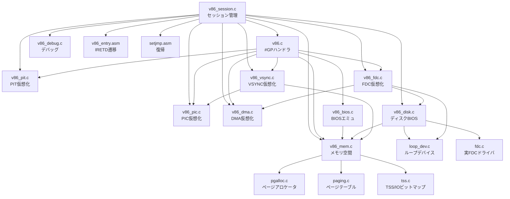

# 1. アーキテクチャ — V86サブシステム構成

## 1.1 設計思想

OS32のV86サブシステムは、i386 CPUの Virtual 8086 Mode を利用して
リアルモード16bitソフトウェアを保護モードカーネル上で実行する。

x86のV86モードでは:
- CPUは **CPL=3** (ユーザモード) でリアルモードの命令セットを実行
- **IOPL=0** に設定することで、全てのI/O命令と特権命令で #GP 発生
- カーネル (#GPハンドラ) が命令をデコードし、エミュレーションまたはパススルー
- ページングは有効のまま → メモリアクセスを制御可能

```
     ┌─────────────────────────────────────────────────────┐
     │  V86 ゲスト (リアルモード互換, CPL=3)               │
     │  ┌──────────┐ ┌──────────┐ ┌───────────┐            │
     │  │ IPL/DOS  │ │ ゲーム   │ │ FORMAT等  │            │
     │  └──────────┘ └──────────┘ └───────────┘            │
     ├─────────────────────────────────────────────────────┤
     │  #GP ハンドラ (v86.c — Ring 0)                      │
     │  ┌──────────────────────────────────────────────┐   │
     │  │ 命令デコーダ: INT/CLI/STI/PUSHF/POPF/IRET/  │   │
     │  │              HLT/IN/OUT/INS/OUTS             │   │
     │  └──────────────────────────────────────────────┘   │
     │  ┌──────────────────────────────────────────────┐   │
     │  │ I/O ディスパッチャ                            │   │
     │  │  v86_in8_checked / v86_out8_checked           │   │
     │  │  → PIC → PIT → FDC → DMA → VSYNC → KBD     │   │
     │  │  → パススルー (IOビットマップ許可) or 実I/O   │   │
     │  └──────────────────────────────────────────────┘   │
     │  ┌──────────────────────────────────────────────┐   │
     │  │ BIOS エミュレータ                             │   │
     │  │  INT 18h / 1Bh / 1Ch / 11h / 12h / 29h      │   │
     │  └──────────────────────────────────────────────┘   │
     │  ┌──────────────────────────────────────────────┐   │
     │  │ IRQ 注入エンジン                              │   │
     │  │  IRQ0(タイマ) / IRQ1(キーボード) / IRQ2(VSYNC)│   │
     │  └──────────────────────────────────────────────┘   │
     ├─────────────────────────────────────────────────────┤
     │  メモリ管理 (v86_mem.c)                             │
     │  ┌──────────────────────────────────────────────┐   │
     │  │ バッキングRAM (640KB, pgalloc動的確保)        │   │
     │  │ ページテーブル (PTE_USER設定)                 │   │
     │  │ IVT/BDA構築 / 画面初期化 / IOビットマップ     │   │
     │  └──────────────────────────────────────────────┘   │
     ├─────────────────────────────────────────────────────┤
     │  セッション管理 (v86_session.c)                     │
     │  ┌──────────────────────────────────────────────┐   │
     │  │ ブートシーケンス / Auto-Typer / ホットキー脱出│   │
     │  │ setjmp/longjmp による安全な復帰               │   │
     │  │ デバイス状態退避・復元 (FM音源/EGC)           │   │
     │  └──────────────────────────────────────────────┘   │
     └─────────────────────────────────────────────────────┘
```

## 1.2 モジュール依存関係



## 1.3 実行フロー概要

```
ユーザーコマンド (vdos / v86boot)
  │
  ▼
v86_boot_image_kapi() / v86_boot_physical_fdd()    [v86_session.c]
  │
  ├── v86_mem_setup()           バッキングRAM確保・ページテーブル構築
  ├── v86_pic_init()            仮想PIC初期化
  ├── v86_pit_init()            仮想PIT初期化
  ├── v86_fdc_virt_init()       仮想FDC初期化
  ├── v86_dma_init()            仮想DMA初期化
  ├── v86_vsync_init()          VSYNC仮想化初期化
  ├── IPLロード (loop_dev/FDC → 0x1FC0:0000)
  ├── FM音源リセット
  ├── メモリスイッチ設定
  │
  ├── exec_setjmp()             復帰点を設定
  ├── v86_enter()               IRETD → V86モード遷移
  │    │
  │    ├── [V86実行中] ────────────────────────────┐
  │    │   特権命令 → #GP → v86_gp_handler()      │
  │    │   HW IRQ → timer_handler → IRQ注入       │
  │    │   (ループ)                                 │
  │    │                                            │
  │    ◄── exec_longjmp() ── 終了条件検知 ─────────┘
  │
  ├── v86_mem_teardown()        ページテーブル復元
  ├── v86_restore_screen()      画面復帰
  ├── v86_tvram_restore()       TVRAM復元
  ├── FM音源/EGC状態復元
  └── リソース解放
```

## 1.4 スタック構成

V86モード中、CPUは2つのスタックを使い分ける:

| スタック | 用途 | サイズ | 配置 |
|---------|------|--------|------|
| V86スタック | ゲスト用 (SS:SP = 0x0000:0xFFFE) | バッキングRAM内 | 仮想 0x0000:0xFFFE |
| カーネルスタック | #GP/IRQハンドラ用 (TSS ESP0) | 64KB | `v86_kstack[]` (静的配列) |

#GP発生時、CPUは自動的にTSS ESP0に切り替え、V86スタックフレーム
(GS/FS/DS/ES/SS/ESP/EFLAGS/CS/EIP) をカーネルスタックにpushする。

## 1.5 コンパイル単位

`build/kernel.mk` の `C_KERNEL` に以下が登録されている:

```
v86.c v86_mem.c v86_bios.c v86_pic.c v86_pit.c
v86_fdc.c v86_dma.c v86_disk.c v86_vsync.c
v86_session.c v86_debug.c v86_event.c v86_disasm.c
v86_dos_ref.c v86_sstep.c v86_watch.c v86_test.c
```

ISR関連: `isr_handlers.c` (例外), `irq_timer.c` (タイマIRQ0)
アセンブリ: `v86_entry.asm` (NASM), `isr_stub.asm` (例外/IRQスタブ)
