# 14. デバッグツール 実装ロードマップ

> [13_debug_tools_design.md](13_debug_tools_design.md) で設計した Tier 1〜4 (18機能)
> の実装順序・前提・受入条件・メモリ消費・KAPI 拡張をまとめる。
>
> 上位ロードマップ ([09_msdos_roadmap.md](09_msdos_roadmap.md)) との連携は §14.7 を参照。

## 14.1 ロードマップ概要

| Phase | 目的 | 工数 | 主機能 |
|-------|------|-----|--------|
| **Phase 1** | DOS5 ハング解析必達インフラ | 1〜1.5 人日 | T1.1 / T1.2 / T1.3 / T2.1 / T4.1 / T4.3 |
| **Phase 2** | 検証カバレッジ拡張 | 1 人日 | T1.4 / T2.2 / T2.3 |
| **Phase 3** | 深部解析・将来用 | 必要時 | T2.4 / T2.5 / T3.1〜T3.6 |
| **Phase 4** | 使い勝手 | 0.5 人日 | T4.2 |
| **計** | | **2.5〜3 人日** + 余力 | 18 機能 |

各 Phase は **独立してリリース可能**。Phase 1 完了で DOS5 解析が開始でき、それ以降は並行可能。

---

## 14.2 Phase 詳細・受入条件

### Phase 1 — DOS5 ハング解析必達 (1〜1.5 人日)

**目的**: DOS5 IPL ハングの原因究明に必要な最小インフラを揃える。

| 機能 | 規模 | 依存 |
|------|------|-----|
| T1.1 HostDrv 定期イベント追記 | ~200行 | なし |
| T1.2 GP TRACE 拡張 + フィルタ | ~50行 | なし |
| T1.3 BDA スナップショット多段化 | kernel ~30行 + py ~150行 | なし |
| T2.1 MEMSW スナップショット | ~40行 | なし |
| T4.1 NP21/W リファレンス採取手順 | ドキュメント整備 | なし |
| T4.3 BDA diff レポート生成 | py ~200行 | T4.1 採取済み / T1.3 |

#### 完了条件 / 受入条件

- [ ] `v86 -d <image>` で 4 つの BDA スナップ (`v86_bda_{init,post_ipl,pre_dos,exit}.bin`) が `/host/debug/` に生成される
- [ ] `v86_events.log` がセッション中 30 tick 毎に追記される
- [ ] ハードハング (タイムアウト発火) でも 80% 以上のイベントが残る
- [ ] GP TRACE が 1024 件保持され、INT フィルタ (`sys_v86_set_trace_filter`) が動作する
- [ ] MEMSW セクションが `v86_diag.log` に init/exit の2ポイントで出力される
- [ ] DOS6.2 で `DEBUG > A:\BDA.TXT` → mtools 抽出 → `reference_dos.bin` の手順が成立
- [ ] `tools/v86_bda_diff.py` で OS32 採取 BDA と reference の Markdown diff が生成される
- [ ] 既存テスト (FreeDOS / Ys / 各種 D88) が回帰しない

#### 検証手段

```bash
bash build.sh                                    # エラー0
make deploy && make deploy-kernel                # デプロイ
v86 -d /host/freedos98.d88                       # FreeDOS で機能確認
v86 -d /host/dos5.fdi                            # DOS5 で診断データ採取
ls -la /host/debug/                              # 全ファイル生成確認
python tools/v86_bda_diff.py /host/debug/v86_bda_exit.bin reference_dos.bin
```

### Phase 2 — 検証カバレッジ拡張 (1 人日)

**目的**: Phase 1 のデータから派生する追加検証項目を拾うインフラ。

| 機能 | 規模 | 依存 |
|------|------|-----|
| T1.4 BIOS ROM FAR CALL | ~80行 | T1.1 (critical event) |
| T2.2 I/O ポート分類 | ~30行 | なし |
| T2.3 IVT 差分 + D3 不整合解消 | ~60行 + 既存3箇所修正 | なし |

#### 完了条件 / 受入条件

- [ ] V86 セッション終了時に `CS >= 0xF000` の場合「reset vector 到達」と「ROM ルーチン途中」が区別表示される
- [ ] `v86_diag.log` に `[ROM CALL]` セクションが追加され、`0x9A` / `0xFF /3` の両命令が記録される
- [ ] I/O 統計が `passthrough / virt / protected / fallthrough` の4分類で出力される
- [ ] `fallthrough` 分類のポートが (もしあれば) リスト化される
- [ ] V86 終了時に変更された IVT ベクタのみが diff 表示される
- [ ] `v86_debug.c:472`, `:755` の `seg == 0x0050` チェックが `V86_DUMMY_IVT_SEG` に修正される
- [ ] `v86.c:646` のコメントが `0x003F:0x0000` に修正される

### Phase 3 — 深部解析・将来用 (必要に応じて)

**目的**: Phase 1/2 で原因が掴めなかった場合の深掘り、または将来の高度な検証用途。

| 機能 | 規模 | 依存 |
|------|------|-----|
| T2.4 メモリウォッチポイント | ~150行 | T3.4 (TF/#DBハンドラ共有) |
| T2.5 DOS_ref テンプレート埋め込み | kernel ~100行 + data 1KB | T4.1 採取済み |
| T3.1 逆アセンブル支援 | ~250行 | T1.2 (opcode コンテキスト) |
| T3.2 PIC EOI シーケンス検証 | ~50行 | なし |
| T3.3 DMA 転送ログ | ~40行 | なし |
| T3.4 シングルステップ (TF) | ~100行 | なし |
| T3.5 条件付きトレース開始 | ~50行 | T1.2 |
| T3.6 シリアル フォールバック | ~30行 | T1.1 |

#### 完了条件 / 受入条件 (項目ごと)

- [ ] T2.4: `v86_dbg_watch_set(0x500, 1)` で BDA 0x500 へのアクセスが記録される (PTE 方式)
- [ ] T2.5: `kernel/v86_dos_ref.c` が生成され、起動時に diff レポートが直接出力可能
- [ ] T3.1: GP TRACE の opcode 列が可読命令文字列に整形される
- [ ] T3.2: ISR 未セット EOI が `WARN orphan EOI` で記録される
- [ ] T3.3: FDD READ/WRITE 時に DMA bank/addr/count が記録される
- [ ] T3.4: `-dss` 起動で全命令がトレースされる (10秒上限)
- [ ] T3.5: `-dt-int=21` でトリガ前 trace が空、後が満たされる
- [ ] T3.6: `-ds` で `<<V86>>` プレフィックス付きイベントがシリアル送出される

### Phase 4 — 使い勝手 (0.5 人日)

**目的**: 取得したログを目視で読まずに済むようにする。

| 機能 | 規模 | 依存 |
|------|------|-----|
| T4.2 V86 ログビューワ | py ~300行 | T1.1 / T1.2 / T1.3 |

#### 完了条件 / 受入条件

- [ ] `tools/v86_log_viewer.py --timeline` で PNG が生成される
- [ ] `--histogram --int 0x18` で AH 別頻度が表形式出力される
- [ ] `--bda v86_bda_exit.bin` でフィールド名注釈付き hex が出る
- [ ] `--trace --filter-int 0x18` で INT 18h トレースのみ出る

---

## 14.3 メモリ消費まとめ

| 機能 | 静的メモリ | 動的メモリ |
|------|----------|----------|
| **T1.1 (event buf 2048 × 16B)** | **+32KB** | 0 |
| T1.2 (1024 trace × 16B) | +16KB | 0 |
| T1.2 (AH histogram 256×256 u8) | +64KB | 0 |
| T1.4 (ROM TRACE 32件) | +0.5KB | 0 |
| T2.1 (MEMSW snapshot 22B × 2) | +0.05KB | 0 |
| T2.2 (I/O stats 64エントリ) | +0.7KB | 0 |
| T2.3 (IVT snapshot 1KB) | +1KB | 0 |
| T2.4 (watch entries 32件) | +0.5KB | 0 |
| T2.5 (DOS ref BDA + mask) | +1KB | 0 |
| T3.2 (EOI log 64件) | +1KB | 0 |
| T3.3 (DMA log 32件) | +0.5KB | 0 |
| **合計** | **~117KB** | **0** |

カーネル全体 (現状 vmkernel 数MB) への影響は許容範囲。T1.2 のヒストグラムが最大寄与のため、ビルドフラグでの切離しを推奨。

---

## 14.4 ビルドフラグでの分離

すべてのデバッグ機能は `V86_DEBUG_ENABLED` ビルドフラグでビルド外しできるよう設計。

```c
#ifdef V86_DEBUG_ENABLED
/* デバッグ専用コード */
#endif
```

本番ビルドではコード/データ量を増やさない (リリース可読性確保)。
`build/kernel.mk` 等で `-DV86_DEBUG_ENABLED` を制御可能にする。

---

## 14.5 I/O 帯域とフォールバック

- **T1.1 (HostDrv 定期追記)**: 1 flush ~1ms 想定、300ms 周期で平均オーバーヘッド < 0.5%
- **T3.6 (シリアル フォールバック)**: HostDrv 不在環境のみ。19200bps 以上推奨

T1.1 が主、T3.6 が補助という関係は明確に維持する。

---

## 14.6 KAPI 拡張要否

ユーザーランドからデバッグ機能を制御する場合、以下の KAPI 追加候補:

| KAPI 関数 (案) | 目的 | Tier |
|--------------|------|------|
| `sys_v86_set_event_log(int enable)` | T1.1 HostDrv イベントログ ON/OFF | 1 |
| `sys_v86_set_trace_filter(int int_no)` | T1.2 INTフィルタ | 1 |
| `sys_v86_set_watch(u32 addr, u32 size)` | T2.4 ウォッチ設定 | 2 |
| `sys_v86_set_trace_trigger(int kind, u32 a1, u32 a2)` | T3.5 条件付きトレース | 3 |
| `sys_v86_set_debug_stream(int enable)` | T3.6 シリアル フォールバック ON/OFF | 3 |

各 KAPI 追加時のチェックリスト ([CLAUDE.md] 準拠):
1. `exec/exec.h` の `KernelAPI` 構造体**末尾**に追加 (バイナリ互換)
2. `kapi/kapi_*.c` に `__cdecl` ラッパー実装
3. `exec/exec.c` の `exec_init()` にテーブル登録
4. `programs/os32api.h` に宣言追加
5. `KAPI_VERSION` インクリメント + `KAPI_SPEC.md` 更新

---

## 14.7 上位ロードマップとの連携

### `09_msdos_roadmap.md` (MS-DOS ブート工程) との対応

| 09 Phase | 完了に必要な本書 Phase |
|---------|---------------------|
| 09 Phase 1: IPL→IO.SYS→MSDOS.SYS→COMMAND.COM | **本書 Phase 1 必須** (BDA差分 / GP trace / イベントログ) |
| 09 Phase 2: DOSプロンプト→コマンド実行 | 本書 Phase 1 で十分 (回帰確認) |
| 09 Phase 3: DOSネイティブアプリ | 本書 Phase 2 推奨 (ROM CALL / IVT diff) |
| 09 Phase 4: PC-98ネイティブゲーム | 本書 Phase 2 + T3.3 (DMA) |

**重要な依存**: `09_msdos_roadmap.md §9.2 Step1/2/3` の検証は **本書 Phase 1 (T1.1/T1.3/T4.1/T4.3) の実装完了が前提**。実装前は手作業ベースの代替手段になるが効率が極端に低下する。

### `11_gaps_and_verification.md` (検証項目一覧) との対応

| 11 カテゴリ | 完了に必要な本書 Phase |
|----------|---------------------|
| A1〜A6 (高優先度) | Phase 1 必須 + Phase 2 推奨 |
| B1〜B6 (中優先度) | Phase 2 推奨 (T1.4 / T3.3) |
| C1〜C6 (低優先度) | Phase 3 (T2.4 などで深掘り可) |
| D1〜D6 (設計整合性) | Phase 2 (T2.2 / T2.3 で大半解消) |
| E1〜E7 (PC-98/PC/AT差分) | デバッグ対象外 (チェックリスト) |

---

## 14.8 機能依存関係 (Mermaid)

```mermaid
graph TD
    %% Phase 1
    T11[T1.1 HostDrv event log] --> T14[T1.4 ROM CALL]
    T11 --> T36[T3.6 Serial fallback]
    T12[T1.2 GP TRACE 拡張]
    T13[T1.3 BDA snapshot]
    T13 --> T43[T4.3 BDA diff py]
    T21[T2.1 MEMSW snapshot]
    T41[T4.1 NP21/W ref 採取]
    T41 --> T43
    T41 --> T25[T2.5 DOS_ref テンプレート]
    T43 --> T25

    %% Phase 2
    T22[T2.2 I/O 分類]
    T23[T2.3 IVT diff + D3 fix]

    %% Phase 3
    T34[T3.4 TF singlestep] --> T24[T2.4 Watchpoint]
    T12 --> T31[T3.1 逆アセンブル]
    T12 --> T35[T3.5 条件付き trace]
    T32[T3.2 PIC EOI]
    T33[T3.3 DMA log]

    %% Phase 4
    T11 --> T42[T4.2 Log viewer]
    T12 --> T42
    T13 --> T42

    %% Phase color
    classDef phase1 fill:#cfc,stroke:#3a3
    classDef phase2 fill:#cff,stroke:#39c
    classDef phase3 fill:#fcc,stroke:#c33
    classDef phase4 fill:#ffc,stroke:#cc3
    class T11,T12,T13,T21,T41,T43 phase1
    class T14,T22,T23 phase2
    class T24,T25,T31,T32,T33,T34,T35,T36 phase3
    class T42 phase4
```



凡例:
- 🟢 Phase 1 / 🔵 Phase 2 / 🔴 Phase 3 / 🟡 Phase 4
- 矢印 = 「A → B」は A が B の前提

---

## 14.9 関連ドキュメント

| ドキュメント | 関係 |
|------------|------|
| [12_debug_tools_inventory.md](12_debug_tools_inventory.md) | 既存機能棚卸し |
| [13_debug_tools_design.md](13_debug_tools_design.md) | 機能設計 (各 Tx.x の詳細) |
| [11_gaps_and_verification.md](11_gaps_and_verification.md) | 上流の検証項目 |
| [09_msdos_roadmap.md](09_msdos_roadmap.md) | MS-DOS ブート工程ロードマップ |
| `/mnt/c/WATCOM/CLAUDE.md` | KAPI 追加手順の一般規約 |
